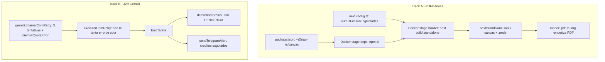

# Fix Validação em Produção — Design

**Spec**: `.specs/features/20260606-fix-validacao-producao/spec.md`
**Status**: Draft

---

## Architecture Overview

Dois problemas independentes, dois "tracks" de correção que não se cruzam no código:

- **Track A (P1):** garantir o binário nativo `@napi-rs/canvas` no container, para o `pdfjs-dist` (via `pdf-to-img`) renderizar PDF. Mudança em **build/empacotamento** (`package.json`, `next.config.ts`, `Dockerfile`). Zero mudança de lógica.
- **Track B (P2):** padronizar o retry do Gemini em **3 tentativas**; ao esgotar, parar de tentar, cair em `PENDENCIA` (já é o comportamento) e **alertar** quando a causa for cota/429. Mudança em `gemini.ts`, `executar-validacoes.ts` e `iniciar/route.ts`.
- **Track C (P3):** runbook operacional (seção neste documento).



---

## Track A — PDF / `@napi-rs/canvas` (P1)

### Causa raiz (recapitulada)

`pdf-to-img` → `pdfjs-dist` carrega `@napi-rs/canvas` via `require` dinâmico dentro de `try/catch` (dependência **opcional**). O file-tracer (`@vercel/nft`) do Next `output: 'standalone'` **não segue** esse require → o pacote e seu binário `.node` não vão para `.next/standalone/node_modules`. Em runtime, sem canvas, o pdfjs tenta usar `DOMMatrix` (API de browser) → `ReferenceError`.

### Solução (defense-in-depth, 3 camadas)

1. **Declarar a dependência** em `package.json` → `dependencies` (`@napi-rs/canvas`). Garante que `npm ci` instale o binário **linux** correto no estágio `deps` do Docker (a imagem base é `node:22-bookworm-slim`, então o binário gerado é o de produção).
2. **Forçar o tracing** via `next.config.ts` → `outputFileTracingIncludes`, apontando a rota da API que renderiza PDF para incluir os arquivos do pacote (incluindo o `.node`). Isso resolve o que o nft não consegue inferir sozinho.
3. **Marcar como external** em `serverExternalPackages` (junto de `pdf-to-img`), evitando que o Next tente bundlar o módulo nativo.

```ts
// next.config.ts (trecho proposto)
const nextConfig: NextConfig = {
  output: 'standalone',
  serverExternalPackages: ['pdf-to-img', '@napi-rs/canvas'],
  outputFileTracingRoot: projectRoot,
  outputFileTracingIncludes: {
    // chave = rota; valor = globs a forçar no trace standalone
    '/api/validacao/iniciar': [
      './node_modules/@napi-rs/canvas/**/*',
      './node_modules/@napi-rs/canvas-*/**/*',
    ],
  },
  // ...resto inalterado
};
```

### Fallback (se o `outputFileTracingIncludes` não capturar o `.node`)

Copiar o pacote explicitamente no `Dockerfile`, do estágio `deps` para o `runner`, ao lado do standalone:

```dockerfile
# após COPY do standalone, no estágio runner
COPY --from=deps /app/node_modules/@napi-rs/canvas ./node_modules/@napi-rs/canvas
```

> Preferir a abordagem via `outputFileTracingIncludes` (declarativa, versionada no config). O `COPY` é o plano B caso o glob não traga o binário.

---

## Track B — Tratamento do 429 / cota (P2)

### Decisão de comportamento (confirmada 2026-06-06)

Manter retry; **3 tentativas no total**; ao esgotar → parar, `PENDENCIA` + alerta. Não distinguir billing de rate-limit (todo 429 segue a mesma regra).

### Problema atual

Dois níveis de retry **se multiplicam**: `chamarComRetry` (3 chamadas) dentro de cada tarefa, e `executarComRetry` re-tenta **qualquer** erro não-timeout mais 1 vez → até ~6 chamadas Gemini por validação num 429. Isso contraria "3 tentativas" e infla a latência (30-43s nos logs).

### Solução

1. **Tipar o erro de cota:** em `gemini.ts`, após esgotar `MAX_RETRIES` em um 429, lançar um erro tipado `GeminiQuotaError` (em vez de repassar o erro cru). `chamarComRetry` continua sendo a **autoridade única** das 3 tentativas de 429.
2. **Não re-tentar cota no nível de cima:** em `executarComRetry`, se o erro for `GeminiQuotaError` (ou contiver assinatura de 429/cota), ir direto para `rejected` (sem o retry extra). Mantém o retry único para erros realmente transitórios não-cota.
3. **Status `PENDENCIA`:** nenhum código novo — `ErroTarefa` já mapeia para `status: 'erro'` → `determinarStatusFinal` → `PENDENCIA`. Apenas confirmar via teste.
4. **Alerta de cota:** em `executarPipeline` (após `executarValidacoes`), detectar se alguma validação falhou com assinatura de cota e disparar `sendTelegramAlert` com mensagem acionável. Disparo **idempotente por execução** (um alerta por pipeline, não um por documento) e protegido por flag para não spammar.

```ts
// gemini.ts (trecho proposto)
export class GeminiQuotaError extends Error {
  constructor(message: string) {
    super(message);
    this.name = 'GeminiQuotaError';
  }
}

function isQuotaError(msg: string): boolean {
  return msg.includes('429')
    || msg.includes('RESOURCE_EXHAUSTED')
    || msg.toLowerCase().includes('credits are depleted');
}

async function chamarComRetry(fn, tentativa = 0) {
  try {
    return await fn();
  } catch (err) {
    const msg = err instanceof Error ? err.message : String(err);
    if (isQuotaError(msg)) {
      if (tentativa < MAX_RETRIES) {            // MAX_RETRIES=2 → 3 tentativas
        await new Promise((r) => setTimeout(r, RETRY_DELAY_MS));
        return chamarComRetry(fn, tentativa + 1);
      }
      throw new GeminiQuotaError(msg);          // esgotou: erro tipado
    }
    throw err;
  }
}
```

```ts
// executar-validacoes.ts (trecho do catch em executarComRetry)
} catch (e) {
  const msg = e instanceof Error ? e.message : String(e);
  const isCota = e instanceof Error && e.name === 'GeminiQuotaError';
  if (e instanceof TimeoutValidacaoError || isCota || Date.now() >= deadline) {
    return { status: 'rejected' as const, reason: e };   // sem retry extra p/ cota
  }
  // ...retry único existente para transitórios não-cota
}
```

---

## Track C — Runbook operacional (P3)

### Runbook 1: Créditos do Gemini esgotados (erro 429 / `credits depleted`)

**Sintoma:** alerta Telegram "Créditos Gemini esgotados"; validações de selfie/comprovante/vídeos caindo em `PENDENCIA`; logs com `[429 Too Many Requests] ... prepayment credits are depleted`.

**Ação:**
1. Acessar o Google AI Studio → projeto da chave em uso (`GEMINI_API_KEY`): https://ai.studio/projects (billing em https://ai.google.dev/gemini-api/docs/billing#prepay).
2. Recarregar créditos pré-pagos **ou** trocar a `GEMINI_API_KEY` por uma de projeto com saldo.
3. Se trocar a chave: atualizar a env var `GEMINI_API_KEY` no Coolify e **redeploy/restart** do serviço.
4. Validar: enviar um documento de teste e confirmar nos logs uma validação `APROVADO/REJEITADO` (não `ERRO ... 429`).

**Prevenção:** monitorar saldo; configurar alerta de saldo baixo no AI Studio, se disponível.

### Runbook 2: PDF voltou a falhar (`DOMMatrix is not defined` / `Cannot find module '@napi-rs/canvas'`)

**Sintoma:** validações `cnh`/`biometria` (PDF) com `ReferenceError: DOMMatrix is not defined`; warnings `Cannot polyfill DOMMatrix/ImageData/Path2D` no boot.

**Causa provável:** atualização de `pdf-to-img`/`pdfjs-dist`/Next removeu o `@napi-rs/canvas` do standalone, ou o `outputFileTracingIncludes` deixou de casar (mudança de path/versão do pacote).

**Ação:**
1. Confirmar no container: `ls node_modules/@napi-rs/canvas` (ou no `.next/standalone/node_modules`). Se ausente → tracing quebrou.
2. Conferir se `@napi-rs/canvas` segue em `package.json` `dependencies` e se os globs em `outputFileTracingIncludes` ainda batem com o path/versão instalada.
3. Se necessário, aplicar o fallback de `COPY` no Dockerfile (Track A).
4. Rebuild da imagem e validar com uma CNH em PDF de teste; confirmar ausência dos warnings de polyfill.

---

## Code Reuse Analysis

### Existing Components to Leverage

| Component | Location | How to Use |
| --- | --- | --- |
| `chamarComRetry` | `lib/ai/gemini.ts:63` | Estender: lançar `GeminiQuotaError` ao esgotar 429 |
| `executarComRetry` | `lib/ai/pipeline/executar-validacoes.ts:58` | Modificar: não re-tentar erro de cota |
| `determinarStatusFinal` | `lib/ai/pipeline/determinar-status.ts:44` | Reusar como está (erro → `PENDENCIA`) |
| `sendTelegramAlert` | `lib/telegram-alert.ts` | Reusar para alerta de cota |
| `MAX_RETRIES` / `RETRY_DELAY_MS` | `lib/ai/gemini.ts:6-7` | Reusar (3 tentativas já = MAX_RETRIES 2) |
| Runner de testes | `lib/ai/pipeline/__tests__/` + `npm test` | Adicionar teste de classificação de cota |

### Integration Points

| System | Integration Method |
| --- | --- |
| Coolify (env vars) | `GEMINI_API_KEY`, `TELEGRAM_BOT_TOKEN`, `TELEGRAM_CHAT_ID` já usados; runbook documenta troca de chave |
| Docker build | `deps` instala canvas (linux); `builder` gera standalone com o tracing |
| MongoDB `conversations` | `statusDocumentos` já gravado pelo pipeline; sem mudança de schema |

---

## Components

### `GeminiQuotaError` (novo)

- **Purpose**: Tipar erro de cota/429 esgotado para o nível superior não re-tentar.
- **Location**: `lib/ai/gemini.ts`
- **Interfaces**: `class GeminiQuotaError extends Error` (`name = 'GeminiQuotaError'`)
- **Dependencies**: nenhuma
- **Reuses**: padrão de `TimeoutValidacaoError` em `executar-validacoes.ts`

### `chamarComRetry` (modificar)

- **Purpose**: Autoridade única do retry de 429 (3 tentativas); ao esgotar, lança `GeminiQuotaError`.
- **Location**: `lib/ai/gemini.ts:63`
- **Reuses**: `MAX_RETRIES`, `RETRY_DELAY_MS`

### `executarComRetry` (modificar)

- **Purpose**: Não aplicar retry extra a erro de cota (evita 6 chamadas).
- **Location**: `lib/ai/pipeline/executar-validacoes.ts:58`
- **Reuses**: estrutura de catch/timeout existente

### Alerta de cota no pipeline (modificar)

- **Purpose**: Disparar 1 alerta Telegram por execução quando houver falha de cota.
- **Location**: `app/api/validacao/iniciar/route.ts` (`executarPipeline`, após `executarValidacoes`)
- **Reuses**: `sendTelegramAlert`; padrão do alerta de `ANALISE_MANUAL` (linha ~190)

### Empacotamento PDF (modificar)

- **Purpose**: Garantir `@napi-rs/canvas` no standalone.
- **Location**: `package.json`, `next.config.ts`, `Dockerfile` (fallback)

---

## Error Handling Strategy

| Error Scenario | Handling | User Impact |
| --- | --- | --- |
| PDF sem canvas (`DOMMatrix`) | Resolvido na origem (binário no standalone) | Nenhum — validação roda normal |
| 429 transitório | Retry até 3 tentativas | Latência um pouco maior; tende a passar |
| 429 cota esgotada | 3 tentativas → `GeminiQuotaError` → `PENDENCIA` + alerta | Documento em pendência/análise manual; sem trava |
| Timeout (120s) | `TimeoutValidacaoError` → `rejected` → `PENDENCIA` | Pendência (comportamento atual) |
| Telegram indisponível | `sendTelegramAlert` já loga e não lança | Nenhum no fluxo; alerta perdido (logado) |

---

## Tech Decisions (não óbvias)

| Decision | Choice | Rationale |
| --- | --- | --- |
| Incluir canvas no standalone | `outputFileTracingIncludes` (preferido) + dep declarada; `COPY` como fallback | nft não segue `require` dinâmico opcional; tracing declarativo é versionável |
| Onde centralizar o retry de 429 | `chamarComRetry` (gemini) como autoridade; `executarComRetry` ignora cota | Evita multiplicação (6→3 tentativas) e respeita a decisão de "3 tentativas" |
| Distinguir billing vs rate-limit | Não distinguir | Decisão do usuário; mensagem nem sempre confiável |
| Granularidade do alerta | 1 por execução de pipeline | Evita spam (até 6 docs por execução) |
| Não tocar `determinarStatusFinal` | Reuso integral | `erro → PENDENCIA` já atende o requisito |

---

## Tips de implementação

- Validar com `npm test` (runner nativo) e `npx tsc --noEmit` após cada mudança — padrão já usado no projeto.
- Track A só é verificável de fato na imagem Docker (dev tem `node_modules` completo). Incluir verificação no container no checklist.
- Não alterar `cruzamento`/decisão — fora de escopo (feature `refatoracao-pipeline-validacao`).
