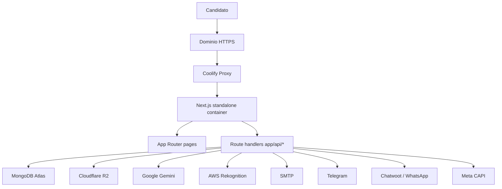

# Migracao para Coolify VPS Design

**Spec**: `.specs/features/migracao-coolify-vps/spec.md`
**Status**: Draft

---

## Architecture Overview

A migracao deve manter o `formulario-credfacil` como um monolito Next.js full-stack. O frontend, as rotas `app/api/*`, autenticacao via JWT, upload R2 e pipeline de validacao IA continuam no mesmo processo Node.js. O Coolify sera responsavel por build, deploy, variaveis de ambiente, proxy HTTPS e restart do container.



---

## Code Reuse Analysis

### Existing Components to Leverage

| Component | Location | How to Use |
| --- | --- | --- |
| Next standalone config | `next.config.ts` | Reusar `output: 'standalone'` como base do Dockerfile. |
| Build script | `package.json` | Reusar `npm run build`, que ja chama `next build --webpack`. |
| Env example | `.env.example` | Usar como fonte primaria da checklist Coolify. |
| MongoDB singleton | `lib/mongodb.ts` | Validar conectividade sem alterar contrato de dados. |
| APIs existentes | `app/api/*/route.ts` | Manter como backend do monolito; nao criar servico separado. |

### Integration Points

| System | Integration Method |
| --- | --- |
| Coolify | Dockerfile no subdiretorio `formulario-credfacil`, porta `3000`, variaveis pelo painel. |
| MongoDB Atlas | `MONGODB_URI` em variavel de ambiente. |
| Cloudflare R2 | Credenciais S3-compatible em variaveis de ambiente. |
| Gemini / Rekognition | Credenciais externas consumidas pelas libs atuais. |
| SMTP / Telegram / Chatwoot / Meta | Variaveis existentes mantidas no Coolify. |
| DNS | Dominio aponta para proxy do Coolify apos validacao em staging. |

---

## Components

### Dockerfile standalone

- **Purpose**: Produzir imagem Docker pequena e reproduzivel para o app Next.js.
- **Location**: `Dockerfile`
- **Interfaces**:
  - Build args: nenhum obrigatorio.
  - Runtime env: `PORT=3000`, `HOSTNAME=0.0.0.0`, variaveis do `.env.example`.
- **Dependencies**: Node.js LTS, `package-lock.json`, `.next/standalone`.
- **Reuses**: `next.config.ts` com `output: 'standalone'`.

### Docker ignore

- **Purpose**: Evitar que cache, dependencias locais, segredos e artefatos pesados entrem no contexto Docker.
- **Location**: `.dockerignore`
- **Dependencies**: Nenhuma.
- **Reuses**: Padroes atuais de `.gitignore`.

### Health route

- **Purpose**: Fornecer endpoint simples para smoke test e health check do Coolify.
- **Location**: `app/api/health/route.ts`
- **Interfaces**:
  - `GET /api/health` retorna `{ ok, service, timestamp, env }`.
- **Dependencies**: Somente variaveis de ambiente; nao deve fazer chamadas externas obrigatorias.
- **Reuses**: Padrao de route handlers existentes.

### Deploy runbook

- **Purpose**: Documentar configuracao no Coolify, variaveis, DNS, smoke tests, go-live e rollback.
- **Location**: `.specs/features/migracao-coolify-vps/deploy-runbook.md`
- **Dependencies**: `.env.example`, `package.json`, `next.config.ts`.
- **Reuses**: Estrutura TLC e informacoes de `.specs/codebase/INTEGRATIONS.md`.

---

## Runtime Model

```text
Build:
  npm ci
  npm run build
  copy .next/standalone + .next/static + public

Start:
  node server.js
  HOSTNAME=0.0.0.0
  PORT=3000
```

O Coolify deve ser configurado com base directory `formulario-credfacil` quando o repositorio raiz `credfacil` for usado. Se o deploy apontar diretamente para o projeto, o base directory pode ficar vazio.

---

## Error Handling Strategy

| Error Scenario | Handling | User Impact |
| --- | --- | --- |
| Build Docker falha | Corrigir Dockerfile/dependencias antes de deploy; nao alterar DNS. | Nenhum impacto em producao. |
| Env obrigatoria ausente | Health route indica configuracao incompleta por nome da variavel, sem valor. | Operador corrige no Coolify. |
| Servico externo indisponivel | Fluxos existentes devem continuar retornando erros controlados conforme APIs atuais. | Usuario ve erro ja previsto pelo app. |
| Deploy novo instavel | Rollback via redeploy da imagem anterior ou DNS para Vercel. | Janela curta de indisponibilidade se DNS ja mudou. |
| Validacao IA pesada no container | Medir memoria/CPU/logs; se recorrente, planejar worker separado. | Pode haver lentidao no envio/validacao. |

---

## Tech Decisions

| Decision | Choice | Rationale |
| --- | --- | --- |
| Backend/frontend | Manter juntos no Next.js | O backend atual sao route handlers do proprio app; separar agora aumenta CORS, deploys e segredos duplicados. |
| Deploy | Dockerfile standalone | Mais previsivel que Nixpacks para Next.js com dependencias nativas e `pdf-to-img`. |
| Banco/storage | Manter externos | Reduz risco de perda de dados e responsabilidade de backup no VPS. |
| Health check | Endpoint leve sem chamadas externas | Evita derrubar container por falha transitoria de terceiros. |
| Worker IA | Fora do MVP | Extrair apenas se houver timeout, memoria alta ou concorrencia real. |

---

## Future Worker Extraction Criteria

Planejar um worker separado somente se um destes sinais aparecer em producao:

- Uso de memoria do container passa de 75% de forma recorrente durante validacoes.
- Validacao de documentos ultrapassa o tempo aceitavel do fluxo ou causa timeouts HTTP.
- Mais de uma validacao simultanea degrada o formulario publico.
- Logs mostram falhas por CPU, memoria, processo finalizado ou restart do container.

Nesse futuro desenho, o Next.js continuaria recebendo uploads e exibindo status; o worker consumiria jobs registrados no MongoDB e gravaria resultados no mesmo contrato de `statusDocumentos`.
