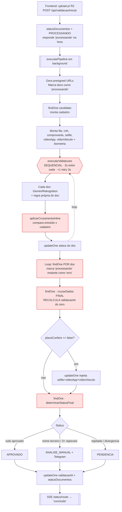
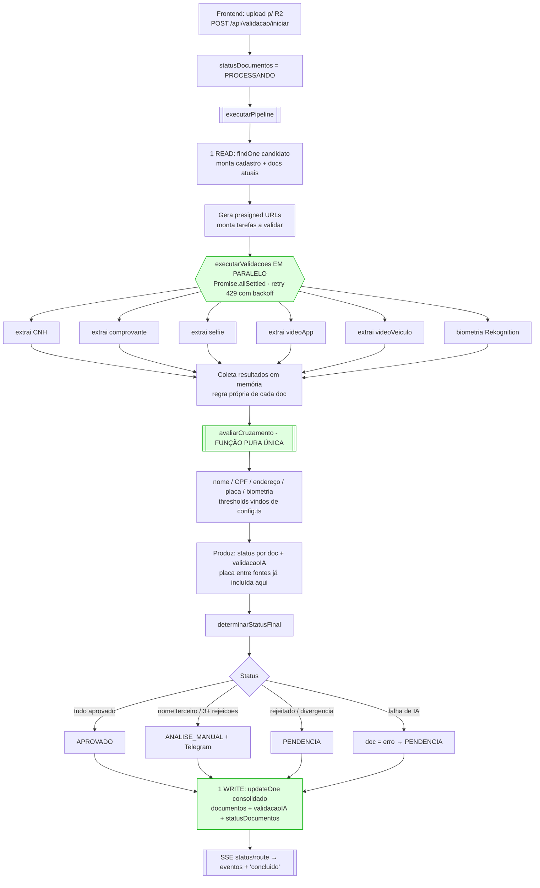

# Refatoração do Pipeline de Validação — Design

**Spec**: `.specs/features/refatoracao-pipeline-validacao/spec.md`
**Status**: Draft

---

## Arquitetura Atual (AS-IS)

Hoje o fluxo é assíncrono *fire-and-forget*, sequencial e com cruzamento duplicado.

### Camadas

| Camada | Arquivo | Papel |
|---|---|---|
| Entrada | `app/api/validacao/iniciar/route.ts` | Dispara o pipeline em background, responde na hora |
| Pipeline | `lib/ai/pipeline/` | Orquestra validações → cruzamento → status |
| Validações | `lib/ai/validacoes/` | 1 arquivo por documento + IA (Gemini/Rekognition) |
| Saída | `app/api/validacao/status/route.ts` | SSE: polling no Mongo a cada 2s |

### Fluxograma — estado atual



> 🔴 Em vermelho: os pontos problemáticos — execução sequencial (`G`), cruzamento duplicado (`I` + `L`), e múltiplos `findOne` (`K`, `L`, `O`).

### Dores mapeadas

| # | Problema | Local | Impacto |
|---|---|---|---|
| 1 | Execução sequencial + delay fixo 2s | `executar-validacoes.ts:53-55` | Lentidão (2–5 min) |
| 2 | `findOne` dentro de loop por documento | `iniciar/route.ts:124` | 5+ queries desnecessárias |
| 3 | Cruzamento duplicado (inline + final) | `cruzamento-inline.ts` + `cruzamento.ts` | Manutenção / bugs |
| 4 | Thresholds hardcoded fora do config | `cruzamento.ts` (85, 80, 90, 70) | Dessincronização |
| 5 | `comprovanteNomeDivergente` calculado 2x | `comprovante.ts` + `cruzamento.ts` | Redundância |
| 6 | `analise_manual` cai em `'analisando'` na UI | `status/route.ts:47-52` | Bug de UX |
| 7 | Pipeline fire-and-forget pós-resposta | `iniciar/route.ts:206` | Risco em serverless |

---

## Arquitetura Proposta (TO-BE)

Mesma divisão em camadas, mas com **execução paralela**, **cruzamento unificado puro** e **acesso mínimo ao banco**. O cruzamento vira uma função pura (sem I/O) que recebe todos os `dadosExtraidos` + cadastro e devolve, de uma só vez, o status de cada documento E o `validacaoIA`.

### Fluxograma — estado proposto



> 🟢 Em verde: os ganhos — execução paralela (`F`), cruzamento unificado e puro (`I`), e escrita única consolidada (`T`).

### Comparação AS-IS × TO-BE

| Aspecto | Atual | Proposto |
|---|---|---|
| Execução das IAs | Sequencial + 2s delay | Paralela (`Promise.allSettled`) |
| Tempo típico | 2–5 min | < 60s |
| Módulos de cruzamento | 2 (inline + final) | 1 (puro) |
| Thresholds | Espalhados/hardcoded | Centralizados em `config.ts` |
| Operações pesadas no Mongo | 8–10 | 2 (1 read + 1 write) |
| `analise_manual` na UI | Vira "analisando" (bug) | Status próprio |

---

## Code Reuse Analysis

### Componentes existentes a aproveitar

| Componente | Local | Como usar |
|---|---|---|
| `calcularSimilaridade` | `lib/ai/cruzamento.ts` | Mover para o módulo puro de cruzamento (Levenshtein, sem mudança) |
| `cruzarDados` | `lib/ai/cruzamento.ts` | Base do novo módulo unificado — absorve as regras inline |
| `determinarStatusFinal` | `lib/ai/pipeline/determinar-status.ts` | Reutilizar quase sem mudança (já é puro) |
| `config.ts` | `lib/ai/pipeline/config.ts` | Destino único dos thresholds (já existe parcialmente) |
| Funções `validar*` | `lib/ai/validacoes/*` | Manter a regra própria de cada doc; remover apenas o cruzamento que vaza para elas (ex.: `nomeDivergente` no comprovante) |
| `analisarImagem/Video/ComEspelho` | `lib/ai/gemini.ts` | Sem mudança — já têm retry de 429 |
| `compararRostos` | `lib/ai/rekognition.ts` | Sem mudança |

### Integration Points

| Sistema | Método de integração |
|---|---|
| MongoDB `conversations` | Mesma collection; reduzir para read inicial + write consolidado |
| SSE `status/route.ts` | Mesmo contrato de eventos; ajustar apenas o `mapearStatus` |
| Telegram alert | Mesma chamada `sendTelegramAlert` no ramo `ANALISE_MANUAL` |
| R2 (presigned) | `gerarPresignedRead` sem mudança |

---

## Componentes

### `executarValidacoes` (refatorado)

- **Purpose**: Executar as tarefas de validação em paralelo, com retry de rate limit, retornando todos os resultados crus.
- **Location**: `lib/ai/pipeline/executar-validacoes.ts`
- **Interfaces**:
  - `executarValidacoes(tarefas: TarefaValidacao[]): Promise<Map<string, ResultadoTarefa | ErroTarefa>>` — agora sem callback de persistência; só executa e devolve.
- **Dependencies**: funções `validar*`, `config.ts`
- **Reuses**: lógica de retry atual (`executarComRetry`), trocando `for` sequencial por `Promise.allSettled`.

### `avaliarCruzamento` (novo — substitui inline + final)

- **Purpose**: Função **pura** que recebe os dados extraídos de todos os documentos + cadastro e devolve o status de cada documento e o `validacaoIA`.
- **Location**: `lib/ai/pipeline/avaliar-cruzamento.ts`
- **Interfaces**:
  - `avaliarCruzamento(extraidos: DadosExtraidosMap, cadastro: DadosCadastro): { statusPorDoc: Record<TipoDocumento, StatusDocumento>; validacaoIA: ValidacaoIA; motivos: Record<TipoDocumento, string|null> }`
- **Dependencies**: `config.ts`, `calcularSimilaridade`
- **Reuses**: absorve `cruzarCNH/Comprovante/Biometria/VideoApp` (de `cruzamento-inline.ts`) e `cruzarDados` (de `cruzamento.ts`) em uma única passagem. Inclui a regra de placa entre fontes (que hoje vive solta no `route.ts`).

### `config.ts` (consolidado)

- **Purpose**: Único ponto de verdade para thresholds e prazos.
- **Location**: `lib/ai/pipeline/config.ts`
- **Adições**: `THRESHOLD_ENDERECO_LOGRADOURO = 80`, `THRESHOLD_ENDERECO_CIDADE = 85`, `PROPORCAO_CAMPOS_ENDERECO = 0.7`, `FATURAMENTO_MENSAL_MINIMO = 3500`, `MESES_FATURAMENTO = 6` — tudo que hoje está hardcoded.

### `executarPipeline` (orquestrador enxuto)

- **Purpose**: Coordenar read → validações paralelas → cruzamento → status → write único.
- **Location**: `app/api/validacao/iniciar/route.ts`
- **Mudança**: 1 `findOne` no início, montar tudo em memória, 1 `updateOne` consolidado no fim. Atualizações de progresso parcial (`processando`) via update enxuto antes do disparo.

---

## Data Models

Sem mudança nos tipos persistidos (`DocumentoInfo`, `ValidacaoIA`, `DocumentosMap` em `types/documentos.ts`). Novos tipos **internos** ao pipeline:

```typescript
// Resultado cru de uma validação (antes do cruzamento)
type DadosExtraidosMap = Partial<Record<TipoDocumento | 'biometria', {
  aprovadoRegraPropria: boolean
  motivo: string | null
  dadosExtraidos: Record<string, unknown>
}>>

// Saída da função pura de cruzamento
interface ResultadoCruzamento {
  statusPorDoc: Record<TipoDocumento, StatusDocumento>
  motivos: Record<TipoDocumento, string | null>
  validacaoIA: ValidacaoIA
}
```

**Relationships**: `ResultadoCruzamento.statusPorDoc` + `validacaoIA` alimentam `determinarStatusFinal`, exatamente como hoje — só que calculados de uma vez.

---

## Error Handling Strategy

| Cenário de erro | Tratamento | Impacto no usuário |
|---|---|---|
| IA falha após retries (429/timeout) | `Promise.allSettled` captura; doc marcado `erro` | Status final `PENDENCIA`, candidato reenvia |
| Resposta da IA sem JSON válido | `extrairJSON` lança; vira `erro` para aquele doc | `PENDENCIA` |
| Placa divergente entre fontes | Regra dentro de `avaliarCruzamento` | selfie/videoApp/videoVeiculo `rejeitado` |
| Processo morto no meio (serverless) | Documentos não confirmados continuam reprocessáveis (idempotência por `formCode`) | Reenvio re-dispara validação |

---

## Tech Decisions (não óbvias)

| Decisão | Escolha | Racional |
|---|---|---|
| Paralelismo | `Promise.allSettled` (não `all`) | Uma IA falhar não deve abortar as outras; cada doc tem destino independente |
| Cruzamento como função pura | Sem I/O, recebe tudo por parâmetro | Testável isoladamente; elimina recálculo e duplicação |
| Manter regra própria dentro de `validacoes/` | Não fundir com cruzamento | Separação clara: "documento é válido por si" × "documento bate com o cadastro" |
| Não implementar fila agora | Fora de escopo | Refatoração reduz risco serverless mas a fila é trabalho próprio (`feature/fila-validacao-documentos`) |
| Rate limit | Confiar no retry de 429 já existente, remover delay fixo | O delay de 2s era um paliativo; o backoff em `gemini.ts` já cobre o caso real |

---

## Riscos e Mitigação

| Risco | Mitigação |
|---|---|
| Paralelismo estoura quota do Gemini (429 em massa) | Retry com backoff já existe; se necessário, limitar concorrência (ex.: `p-limit` com 3) — manter como ajuste fino |
| Regressão de comportamento de aprovação | Testes de regressão com vetores reais ANTES de mexer (T1), comparando saída AS-IS × TO-BE |
| Diferença sutil entre regra inline e final ao unificar | Mapear linha a linha as duas implementações na T2 antes de fundir |
